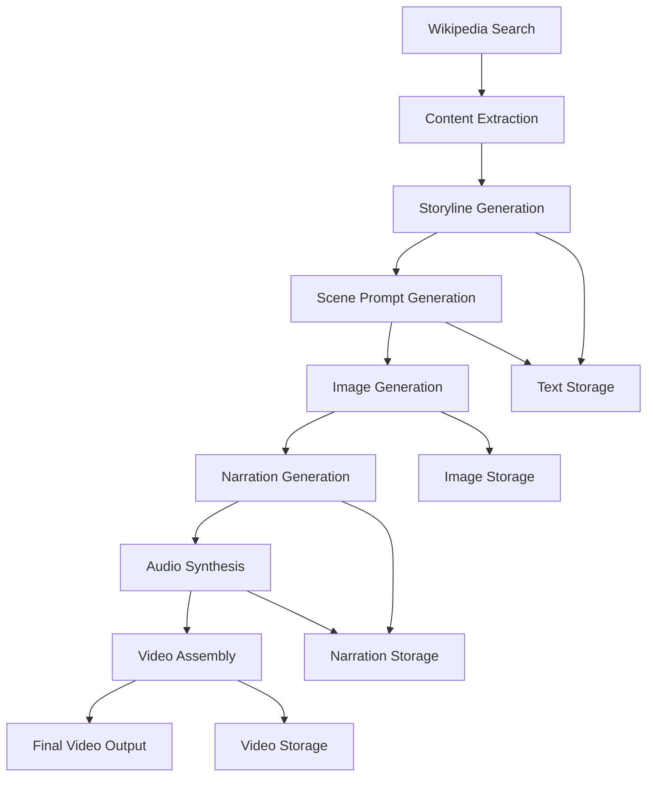

# VidyAI Vizuara - Educational Video Generator 🎬

**Transform Wikipedia Articles into Engaging Educational Videos**

A comprehensive AI-powered system that converts Wikipedia content into professional educational videos using multiple AI models and advanced video processing techniques.

---

## 📋 Table of Contents

1. [Overview](#overview)
2. [Architecture & Models](#architecture--models)
3. [Project Structure](#project-structure)
4. [Installation & Setup](#installation--setup)
5. [Core Components](#core-components)
6. [AI Models & Usage](#ai-models--usage)
7. [Data Flow Pipeline](#data-flow-pipeline)
8. [Configuration](#configuration)
9. [Usage Examples](#usage-examples)
10. [API Reference](#api-reference)
11. [Troubleshooting](#troubleshooting)
12. [Performance & Limits](#performance--limits)

---

## 🎯 Overview

VidyAI Vizuara is an advanced educational video generation system that leverages multiple AI models to create engaging, student-friendly educational content from Wikipedia articles. The system processes text through AI models to generate storylines, visual scenes, narrations, and finally assembles everything into professional videos.

### Key Features

- **Multi-Model AI Pipeline**: Uses Groq (Llama 3.3 70B), Google Gemini 2.5 Flash, gTTS, and MoviePy
- **Student-Friendly Language**: Automatically simplifies complex content for educational use
- **Professional Video Output**: Generates HD videos with synchronized audio and visual effects
- **Comprehensive Content Management**: Saves all generated content for reuse and modification
- **Multi-Language Support**: Supports 10+ languages for narration
- **Cost-Effective**: Completely free to use with generous API limits

---

## 🏗️ Architecture & Models

### System Architecture

```
Wikipedia Article
       ↓
[Wikipedia Extractor] → Raw Content
       ↓
[Groq Llama 3.3 70B] → Storyline Generation
       ↓
[Groq Llama 3.3 70B] → Scene Prompt Generation
       ↓
[Google Gemini 2.5 Flash] → Image Generation
       ↓
[Groq Llama 3.3 70B] → Narration Generation
       ↓
[Google TTS] → Audio Synthesis
       ↓
[MoviePy] → Video Assembly
       ↓
Final Educational Video
```

### AI Models Used

| Model | Purpose | Provider | Cost | Speed | Quality |
|-------|---------|----------|------|-------|---------|
| **Llama 3.3 70B Versatile** | Text Generation | Groq | FREE | ⚡ Very Fast | High |
| **Gemini 2.5 Flash Image** | Image Generation | Google | FREE | 🚀 Fast | High |
| **Google TTS** | Speech Synthesis | Google | FREE | ⚡ Very Fast | Good |
| **MoviePy** | Video Processing | Local | FREE | 🐌 Moderate | Professional |

---

## 📁 Project Structure

```
cap/
├── README.md                           # This comprehensive guide
├── final.py                           # Main Streamlit application
├── requirements.txt                   # Python dependencies
├── test_components.py                 # Component testing suite
├── COMPLETE_GUIDE.md                  # User guide
├── wiki_comic_generator.log          # Application logs
│
├── Core Components/
│   ├── wikipedia_extractor.py         # Wikipedia content extraction
│   ├── story_generator.py            # Storyline and scene generation
│   ├── gemini_image_generator.py     # AI image generation
│   ├── narration_generator.py        # Narration text generation
│   ├── tts_generator.py              # Text-to-speech conversion
│   └── video_editor.py               # Video assembly and processing
│
└── data/                              # Generated content storage
    ├── images/                        # Generated comic panels
    │   ├── TopicName/
    │   │   ├── scene_1.jpg
    │   │   ├── scene_2.jpg
    │   │   └── ...
    ├── narration/                     # Audio and narration files
    │   ├── TopicName/
    │   │   ├── audio/
    │   │   │   ├── scene_1.mp3
    │   │   │   └── ...
    │   │   ├── scene_1_narration.txt
    │   │   └── TopicName_narrations.json
    ├── text/                          # Generated text content
    │   ├── TopicName/
    │   │   ├── TopicName_storyline.txt
    │   │   ├── TopicName_scene_prompts.txt
    │   │   ├── TopicName_page_info.json
    │   │   └── TopicName_combined.txt
    ├── videos/                        # Final video outputs
    │   ├── TopicName.mp4
    │   └── ...
    └── TopicName_data.json           # Wikipedia data cache
```

---

## 🚀 Installation & Setup

### Prerequisites

- **Python**: 3.8 or higher
- **Operating System**: Windows 10/11, macOS, or Linux
- **Memory**: 4GB RAM minimum, 8GB recommended
- **Storage**: 2GB free space
- **Internet**: Stable connection for API calls

### Quick Installation

```bash
# 1. Clone or download the project
cd cap

# 2. Install dependencies
pip install -r requirements.txt

# 3. Set up API keys
# Create .env file with your API keys
echo "GROQ_API_KEY=your_groq_key_here" > .env
echo "GEMINI_API_KEY=your_gemini_key_here" >> .env

# 4. Test installation
python test_components.py

# 5. Run the application
streamlit run final.py
```

### Detailed Installation

#### Step 1: Install Python Dependencies

```bash
# Core packages
pip install streamlit==1.28.0
pip install groq==0.4.1
pip install google-genai==0.3.0
pip install wikipedia==1.4.0
pip install gtts==2.4.0
pip install pydub==0.25.1
pip install Pillow==10.0.0
pip install moviepy==1.0.3
pip install numpy==1.24.3
pip install python-dotenv==1.0.0
pip install requests==2.31.0
pip install regex==2023.8.8
pip install imageio==2.31.3
pip install imageio-ffmpeg==0.4.9
pip install soundfile==0.12.1
pip install ffmpeg-python==0.2.0
```

#### Step 2: Get API Keys

**Groq API Key (for text generation):**
1. Visit [console.groq.com](https://console.groq.com)
2. Sign up for free account
3. Navigate to API Keys section
4. Create new API key
5. Copy the key (starts with `gsk_`)

**Google Gemini API Key (for image generation):**
1. Visit [aistudio.google.com/app/apikey](https://aistudio.google.com/app/apikey)
2. Sign in with Google account
3. Click "Create API Key"
4. Copy the key

#### Step 3: Environment Configuration

Create a `.env` file in the `cap` directory:

```bash
# .env file
GROQ_API_KEY=gsk_your_actual_groq_key_here
GEMINI_API_KEY=your_actual_gemini_key_here
```

#### Step 4: Verify Installation

```bash
# Run component tests
python test_components.py

# Expected output:
# ✓ Environment Variables
# ✓ Module Imports  
# ✓ Gemini API Connection
# ✓ Narration Generator
# ✓ TTS Speed Adjustment
# ✓ Image Generator
```

---

## 🔧 Core Components

### 1. Wikipedia Extractor (`wikipedia_extractor.py`)

**Purpose**: Extracts and processes Wikipedia content

**Key Features**:
- Multi-language Wikipedia support
- Intelligent content truncation for token limits
- Disambiguation handling
- Content caching and storage
- Error handling with retry logic

**Usage**:
```python
from wikipedia_extractor import WikipediaExtractor

# Initialize extractor
extractor = WikipediaExtractor(language="en")

# Search for topics
results = extractor.search_wikipedia("Albert Einstein")

# Get detailed page information
page_info = extractor.get_page_info("Albert Einstein")
```

**API Methods**:
- `search_wikipedia(query, results_limit=15)`: Search Wikipedia
- `get_page_info(title, retries=3)`: Get detailed page data
- `sanitize_filename(filename)`: Clean filenames for storage

### 2. Story Generator (`story_generator.py`)

**Purpose**: Generates educational storylines and scene prompts using Groq

**Key Features**:
- Student-friendly language generation
- Multi-act story structure
- Chronological scene organization
- Content length optimization
- Token limit management

**Usage**:
```python
from story_generator import StoryGenerator

# Initialize generator
generator = StoryGenerator(api_key="your_groq_key")

# Generate storyline
storyline = generator.generate_comic_storyline(
    title="Albert Einstein",
    content=wikipedia_content,
    target_length="medium"
)

# Generate scene prompts
scenes = generator.generate_scene_prompts(
    title="Albert Einstein",
    storyline=storyline,
    comic_style="cartoon",
    num_scenes=10
)
```

**API Methods**:
- `generate_comic_storyline(title, content, target_length)`: Create storyline
- `generate_scene_prompts(title, storyline, comic_style, num_scenes)`: Generate scenes
- `save_story_content(title, storyline, scene_prompts, page_info)`: Save content

### 3. Gemini Image Generator (`gemini_image_generator.py`)

**Purpose**: Generates comic panel images using Google Gemini 2.5 Flash

**Key Features**:
- High-quality image generation
- Style consistency across panels
- Character consistency maintenance
- Error handling with retries
- Placeholder generation on failure

**Usage**:
```python
from gemini_image_generator import GeminiImageGenerator

# Initialize generator
generator = GeminiImageGenerator(api_key="your_gemini_key")

# Generate single image
success = generator.generate_comic_image(
    scene_prompt="A scientist in a laboratory...",
    output_path="scene_1.jpg",
    scene_num=1
)

# Generate complete comic strip
image_paths = generator.generate_comic_strip(
    scene_prompts=scene_list,
    output_dir="data/images",
    comic_title="Albert Einstein"
)
```

**API Methods**:
- `generate_comic_image(scene_prompt, output_path, scene_num)`: Single image
- `generate_comic_strip(scene_prompts, output_dir, comic_title)`: Full strip
- `_enhance_prompt_for_gemini(prompt, style_sheet, character_sheet)`: Prompt optimization

### 4. Narration Generator (`narration_generator.py`)

**Purpose**: Generates educational narrations using Groq

**Key Features**:
- Student-friendly language
- Multiple narration styles
- Voice tone customization
- Duration optimization
- Batch processing

**Usage**:
```python
from narration_generator import NarrationGenerator

# Initialize generator
narrator = NarrationGenerator(api_key="your_groq_key")

# Generate single narration
narration = narrator.generate_scene_narration(
    title="Albert Einstein",
    scene_prompt="A young scientist...",
    scene_number=1,
    narration_style="educational",
    voice_tone="engaging"
)

# Generate all narrations
all_narrations = narrator.generate_all_scene_narrations(
    title="Albert Einstein",
    narration_style="educational",
    voice_tone="engaging"
)
```

**API Methods**:
- `generate_scene_narration(title, scene_prompt, scene_number, ...)`: Single narration
- `generate_all_scene_narrations(title, narration_style, voice_tone)`: All narrations
- `load_story_content(title)`: Load existing content
- `_save_narrations(title, narrations, style, tone)`: Save narrations

### 5. TTS Generator (`tts_generator.py`)

**Purpose**: Converts text to speech using Google TTS

**Key Features**:
- Multiple language support
- Speed adjustment (1.25x default)
- Audio quality optimization
- Batch processing
- Duration estimation

**Usage**:
```python
from tts_generator import synthesize_to_mp3, generate_scene_audios

# Single audio generation
synthesize_to_mp3(
    text="This is a test narration...",
    output_path="audio.mp3",
    lang="en",
    tld="com",
    speed=1.25
)

# Batch audio generation
audio_paths = generate_scene_audios(
    narrations=narration_data,
    title="Albert Einstein",
    base_dir="data/narration",
    lang="en",
    speed=1.25
)
```

**API Methods**:
- `synthesize_to_mp3(text, output_path, lang, tld, speed)`: Single audio
- `generate_scene_audios(narrations, title, base_dir, lang, speed)`: Batch audio
- `estimate_tts_duration_seconds(text, speed)`: Duration estimation
- `adjust_audio_speed(input_path, output_path, speed)`: Speed adjustment

### 6. Video Editor (`video_editor.py`)

**Purpose**: Assembles final videos using MoviePy

**Key Features**:
- Professional video assembly
- Ken Burns effect
- Crossfade transitions
- Audio synchronization
- Multiple resolution support
- Background music support

**Usage**:
```python
from video_editor import build_video

# Generate complete video
result = build_video(
    images=image_paths,
    scene_audio=audio_paths,
    out_dir="data/videos",
    title="Albert Einstein",
    fps=30,
    resolution=(1920, 1080),
    crossfade_sec=0.3,
    min_scene_seconds=3.0
)
```

**API Methods**:
- `build_video(images, scene_audio, out_dir, title, ...)`: Main video builder
- `_estimate_scene_duration(audio_path, min_seconds, head_pad, tail_pad)`: Duration estimation
- `_apply_ken_burns_v2(clip, duration, scene_num, ...)`: Ken Burns effect

---

## 🤖 AI Models & Usage

### 1. Groq Llama 3.3 70B Versatile

**Provider**: Groq  
**Cost**: FREE (6,000 tokens/minute)  
**Speed**: 500+ tokens/second  
**Use Cases**: All text generation tasks

**Configuration**:
```python
model = "llama-3.3-70b-versatile"
temperature = 0.4  # Balanced creativity
max_tokens = 12000  # Maximum output length
top_p = 0.9  # Nucleus sampling
```

**What it generates**:
- **Storylines**: 1,000-word educational narratives
- **Scene Prompts**: 10 visual descriptions (80-120 words each)
- **Narrations**: 10 audio scripts (40-70 words each)

**Prompt Engineering**:
- Uses student-friendly language instructions
- Employs specific formatting requirements
- Includes context from previous generations
- Optimized for educational content

### 2. Google Gemini 2.5 Flash Image

**Provider**: Google AI Studio  
**Cost**: FREE (1,500 requests/day)  
**Speed**: ~1 image/minute  
**Use Cases**: Comic panel generation

**Configuration**:
```python
model = "gemini-2.5-flash-image"
temperature = 0.7  # Creative but consistent
```

**What it generates**:
- **Comic Panels**: 1024x1024 resolution images
- **Style Consistency**: Maintains character and style across panels
- **High Quality**: Professional comic book art
- **No Text**: Ensures no text appears in images

**Prompt Engineering**:
- Detailed visual descriptions
- Style consistency instructions
- Character appearance guidelines
- Technical requirements (aspect ratio, quality)

### 3. Google Text-to-Speech (gTTS)

**Provider**: Google  
**Cost**: FREE (unlimited)  
**Speed**: ~1 audio/second  
**Use Cases**: Narration audio generation

**Configuration**:
```python
lang = "en"  # Language code
tld = "com"  # Accent/region
speed = 1.25  # 25% faster than normal
slow = False  # Normal speech rate
```

**Supported Languages**:
- English (en) - US, UK, India, Australia, Canada, South Africa
- Hindi (hi)
- Spanish (es)
- French (fr)
- German (de)
- Italian (it)
- Portuguese (pt)
- Russian (ru)
- Japanese (ja)
- Chinese (zh-CN)

### 4. MoviePy (Video Processing)

**Provider**: Local installation  
**Cost**: FREE  
**Speed**: ~2 minutes for final video  
**Use Cases**: Video assembly and processing

**Features**:
- Image sequence assembly
- Audio synchronization
- Ken Burns effect
- Crossfade transitions
- Multiple export formats
- Resolution scaling

---

## 🔄 Data Flow Pipeline

### Complete Processing Pipeline



### Step-by-Step Process

1. **Content Acquisition** (30 seconds)
   - User searches Wikipedia
   - System extracts article content
   - Content is cached for reuse

2. **Story Development** (3 minutes)
   - Groq generates educational storyline
   - Content is simplified for students
   - 5-act structure is created

3. **Visual Planning** (1 minute)
   - Groq creates 10 scene descriptions
   - Scenes are optimized for visual storytelling
   - Chronological order is maintained

4. **Image Generation** (10 minutes)
   - Gemini creates 10 comic panels
   - Style consistency is maintained
   - Images are saved as JPG files

5. **Audio Creation** (3 minutes)
   - Groq generates 10 narrations
   - gTTS converts text to speech
   - Audio is speed-adjusted to 1.25x

6. **Video Assembly** (2 minutes)
   - MoviePy combines images and audio
   - Ken Burns effect is applied
   - Crossfade transitions are added
   - Final MP4 video is exported

**Total Processing Time**: ~18 minutes

---

## ⚙️ Configuration

### Environment Variables

```bash
# Required API Keys
GROQ_API_KEY=gsk_your_groq_api_key_here
GEMINI_API_KEY=your_gemini_api_key_here

# Optional Configuration
WIKIPEDIA_LANGUAGE=en
DEFAULT_STORY_LENGTH=medium
DEFAULT_COMIC_STYLE=cartoon
DEFAULT_NUM_SCENES=10
DEFAULT_NARRATION_STYLE=educational
DEFAULT_VOICE_TONE=engaging
DEFAULT_TTS_LANGUAGE=en
DEFAULT_TTS_ACCENT=com
DEFAULT_VIDEO_RESOLUTION=1920x1080
DEFAULT_VIDEO_FPS=30
```

### Story Settings

```python
# Story Length Options
STORY_LENGTHS = {
    "short": 500,    # Quick overview
    "medium": 1000,  # Balanced (recommended)
    "long": 2000     # Detailed story
}

# Comic Style Options
COMIC_STYLES = [
    "cartoon",           # Fun, colorful
    "comic book",        # Classic style
    "manga",            # Japanese style
    "graphic novel",    # Serious, detailed
    "superhero",        # Bold, action-oriented
    "noir",            # Dark, dramatic
    "western comic",    # Clear linework
    "indie comic",      # Unconventional
    "golden age comic", # Classic 50s-70s
    "modern comic"      # Contemporary
]
```

### Narration Settings

```python
# Narration Styles
NARRATION_STYLES = {
    "dramatic": "Exciting, movie-like narration",
    "educational": "Clear, explanatory style",
    "storytelling": "Friendly, conversational",
    "documentary": "Factual, informative"
}

# Voice Tones
VOICE_TONES = {
    "engaging": "Enthusiastic, exciting",
    "serious": "Respectful, thoughtful",
    "playful": "Fun, lighthearted",
    "informative": "Clear, helpful"
}
```

### Video Settings

```python
# Resolution Options
RESOLUTIONS = {
    "1280x720": (1280, 720),   # 720p HD
    "1920x1080": (1920, 1080)  # 1080p Full HD
}

# Frame Rate Options
FPS_OPTIONS = [24, 25, 30]

# Scene Duration Settings
MIN_SCENE_SECONDS = 2.0  # Minimum scene length
HEAD_PAD = 0.15          # Audio fade-in time
TAIL_PAD = 0.15          # Audio fade-out time
CROSSFADE_SEC = 0.3      # Transition duration
```

---

## 📝 Usage Examples

### Basic Usage

```python
# 1. Initialize components
from wikipedia_extractor import WikipediaExtractor
from story_generator import StoryGenerator
from gemini_image_generator import GeminiImageGenerator
from narration_generator import NarrationGenerator
from tts_generator import generate_scene_audios
from video_editor import build_video

# 2. Extract Wikipedia content
extractor = WikipediaExtractor()
page_info = extractor.get_page_info("Albert Einstein")

# 3. Generate storyline
story_gen = StoryGenerator(api_key="your_groq_key")
storyline = story_gen.generate_comic_storyline(
    title="Albert Einstein",
    content=page_info["content"],
    target_length="medium"
)

# 4. Generate scene prompts
scenes = story_gen.generate_scene_prompts(
    title="Albert Einstein",
    storyline=storyline,
    comic_style="cartoon",
    num_scenes=10
)

# 5. Generate images
img_gen = GeminiImageGenerator(api_key="your_gemini_key")
image_paths = img_gen.generate_comic_strip(
    scene_prompts=scenes,
    output_dir="data/images",
    comic_title="Albert Einstein"
)

# 6. Generate narrations
narrator = NarrationGenerator(api_key="your_groq_key")
narrations = narrator.generate_all_scene_narrations(
    title="Albert Einstein",
    narration_style="educational",
    voice_tone="engaging"
)

# 7. Generate audio
audio_paths = generate_scene_audios(
    narrations=narrations,
    title="Albert Einstein",
    base_dir="data/narration"
)

# 8. Create final video
result = build_video(
    images=image_paths,
    scene_audio=audio_paths,
    out_dir="data/videos",
    title="Albert Einstein",
    fps=30,
    resolution=(1920, 1080)
)

print(f"Video created: {result['video_path']}")
```

### Advanced Usage

```python
# Custom configuration
custom_config = {
    "story_length": "long",
    "comic_style": "graphic novel",
    "num_scenes": 15,
    "narration_style": "dramatic",
    "voice_tone": "serious",
    "tts_language": "en",
    "tts_accent": "co.uk",
    "video_resolution": (1920, 1080),
    "video_fps": 24,
    "min_scene_seconds": 4.0
}

# Batch processing multiple topics
topics = ["Moon Landing", "Marie Curie", "Photosynthesis"]

for topic in topics:
    # Process each topic with custom settings
    process_topic(topic, custom_config)
```

### Error Handling

```python
import logging
from wikipedia_extractor import WikipediaExtractor

# Set up logging
logging.basicConfig(level=logging.INFO)
logger = logging.getLogger(__name__)

try:
    extractor = WikipediaExtractor()
    page_info = extractor.get_page_info("Albert Einstein")
    
    if "error" in page_info:
        logger.error(f"Wikipedia error: {page_info['message']}")
        # Handle disambiguation
        if "options" in page_info:
            logger.info(f"Available options: {page_info['options']}")
    else:
        logger.info("Successfully extracted content")
        
except Exception as e:
    logger.error(f"Unexpected error: {str(e)}")
```

---

## 📚 API Reference

### WikipediaExtractor

```python
class WikipediaExtractor:
    def __init__(self, data_dir="data", language="en"):
        """Initialize Wikipedia extractor"""
        
    def search_wikipedia(self, query, results_limit=15, retries=3):
        """Search Wikipedia for topics"""
        # Returns: List[str] or str (error message)
        
    def get_page_info(self, title, retries=3):
        """Get detailed page information"""
        # Returns: Dict[str, Any] with page data or error info
```

### StoryGenerator

```python
class StoryGenerator:
    def __init__(self, api_key, text_dir="data/text"):
        """Initialize story generator"""
        
    def generate_comic_storyline(self, title, content, target_length="medium", max_chars=25000):
        """Generate educational storyline"""
        # Returns: str (storyline text)
        
    def generate_scene_prompts(self, title, storyline, comic_style, num_scenes=10):
        """Generate scene descriptions"""
        # Returns: List[str] (scene prompts)
        
    def save_story_content(self, title, storyline, scene_prompts, page_info=None):
        """Save generated content to files"""
        # Returns: Dict[str, str] (file paths)
```

### GeminiImageGenerator

```python
class GeminiImageGenerator:
    def __init__(self, api_key):
        """Initialize image generator"""
        
    def generate_comic_image(self, scene_prompt, output_path, scene_num, **kwargs):
        """Generate single comic panel"""
        # Returns: bool (success status)
        
    def generate_comic_strip(self, scene_prompts, output_dir, comic_title, **kwargs):
        """Generate complete comic strip"""
        # Returns: List[str] (image file paths)
```

### NarrationGenerator

```python
class NarrationGenerator:
    def __init__(self, api_key, text_dir="data/text", narration_dir="data/narration"):
        """Initialize narration generator"""
        
    def generate_scene_narration(self, title, scene_prompt, scene_number, **kwargs):
        """Generate single scene narration"""
        # Returns: str (narration text)
        
    def generate_all_scene_narrations(self, title, narration_style="dramatic", voice_tone="engaging"):
        """Generate all scene narrations"""
        # Returns: Dict[str, Any] (narration data)
```

### TTS Functions

```python
def synthesize_to_mp3(text, output_path, lang="en", tld="com", slow=False, speed=1.0):
    """Convert text to speech"""
    
def generate_scene_audios(narrations, title, base_dir="data/narration", **kwargs):
    """Generate audio for all scenes"""
    # Returns: Dict[str, str] (scene_key -> audio_path)
    
def estimate_tts_duration_seconds(text, speed=1.0):
    """Estimate audio duration"""
    # Returns: float (seconds)
```

### Video Editor

```python
def build_video(images, scene_audio, out_dir, title, fps=30, resolution=(1920, 1080), **kwargs):
    """Build complete video from images and audio"""
    # Returns: Dict[str, Any] (video info and timings)
```

---

## 🔧 Troubleshooting

### Common Issues

#### 1. API Key Errors

**Problem**: "API key not found" or authentication errors

**Solutions**:
```bash
# Check .env file exists and has correct format
cat .env
# Should show:
# GROQ_API_KEY=gsk_your_key_here
# GEMINI_API_KEY=your_key_here

# Verify keys are valid
python -c "import os; from dotenv import load_dotenv; load_dotenv(); print('Groq:', bool(os.getenv('GROQ_API_KEY'))); print('Gemini:', bool(os.getenv('GEMINI_API_KEY')))"
```

#### 2. Import Errors

**Problem**: ModuleNotFoundError when importing components

**Solutions**:
```bash
# Install missing packages
pip install -r requirements.txt

# Check specific imports
python -c "from groq import Groq; print('Groq OK')"
python -c "from google import genai; print('Gemini OK')"
python -c "from moviepy import ImageClip; print('MoviePy OK')"
```

#### 3. Video Generation Fails

**Problem**: "MoviePy not available" or video creation errors

**Solutions**:
```bash
# Install MoviePy (includes FFmpeg)
pip install moviepy

# Alternative: Install FFmpeg manually
# Windows: Download from https://www.gyan.dev/ffmpeg/builds/
# macOS: brew install ffmpeg
# Linux: sudo apt install ffmpeg

# Test video generation
python -c "from video_editor import build_video; print('Video editor OK')"
```

#### 4. Image Generation Issues

**Problem**: Gemini API errors or no images generated

**Solutions**:
```bash
# Check API key validity
python -c "from google import genai; client = genai.Client(api_key='your_key'); print('Gemini OK')"

# Check daily quota (1,500 requests/day)
# Wait for quota reset or use different API key

# Check internet connection
ping google.com
```

#### 5. Audio Generation Problems

**Problem**: No audio in final video or TTS errors

**Solutions**:
```bash
# Install pydub for audio processing
pip install pydub

# Check audio files exist
ls data/narration/TopicName/audio/

# Test TTS generation
python -c "from tts_generator import synthesize_to_mp3; synthesize_to_mp3('test', 'test.mp3'); print('TTS OK')"
```

### Performance Issues

#### Slow Generation

**Causes & Solutions**:
- **Network latency**: Use during off-peak hours
- **API rate limits**: Reduce concurrent requests
- **Large content**: Reduce story length or scene count
- **System resources**: Close other applications

#### Memory Issues

**Causes & Solutions**:
- **Large images**: Reduce resolution to 720p
- **Many scenes**: Reduce scene count
- **System limits**: Increase available RAM

### Debug Mode

```python
# Enable detailed logging
import logging
logging.basicConfig(level=logging.DEBUG)

# Test individual components
python test_components.py

# Check specific functionality
python -c "
from story_generator import StoryGenerator
gen = StoryGenerator('your_key')
print('Story generator initialized')
"
```

---

## 📊 Performance & Limits

### API Limits

| Service | Free Tier Limit | Cost | Reset Period |
|---------|----------------|------|--------------|
| **Groq** | 6,000 tokens/minute | FREE | Per minute |
| **Gemini** | 1,500 requests/day | FREE | Daily |
| **gTTS** | Unlimited | FREE | N/A |
| **MoviePy** | Unlimited | FREE | N/A |

### Processing Times

| Component | Time per Video | Factors |
|-----------|----------------|---------|
| **Wikipedia Extraction** | 30 seconds | Network speed |
| **Storyline Generation** | 2 minutes | Content length |
| **Scene Generation** | 1 minute | Number of scenes |
| **Image Generation** | 10 minutes | API response time |
| **Narration Generation** | 2 minutes | Content complexity |
| **Audio Generation** | 1 minute | Text length |
| **Video Assembly** | 2 minutes | Resolution, effects |
| **Total** | **~18 minutes** | **All factors** |

### Resource Usage

| Resource | Minimum | Recommended | Peak Usage |
|----------|---------|-------------|------------|
| **RAM** | 2GB | 4GB | 8GB |
| **Storage** | 1GB | 5GB | 20GB |
| **CPU** | 2 cores | 4 cores | 8 cores |
| **Network** | 10 Mbps | 50 Mbps | 100 Mbps |

### Optimization Tips

1. **Reduce Processing Time**:
   - Use fewer scenes (5 instead of 10)
   - Lower resolution (720p instead of 1080p)
   - Shorter story length

2. **Save Resources**:
   - Reuse generated content
   - Cache Wikipedia data
   - Clean up temporary files

3. **Improve Quality**:
   - Use recommended settings
   - Test with simple topics first
   - Review generated content

### Cost Analysis

**Per Video Cost**: $0.00 (completely free)

**Daily Capacity**: 100+ videos (within API limits)

**Monthly Capacity**: 3,000+ videos (free tier)

**Breakdown**:
- Groq: FREE (6,000 tokens/minute)
- Gemini: FREE (1,500 requests/day)
- gTTS: FREE (unlimited)
- MoviePy: FREE (local processing)

---

## 🎯 Best Practices

### Content Selection

**✅ Good Topics**:
- Historical events (Moon Landing, World War II)
- Famous people (Einstein, Marie Curie, Gandhi)
- Scientific concepts (Photosynthesis, Solar System)
- Cultural stories (Ramayana, Mahabharata)
- Educational subjects (Mathematics, Physics)

**❌ Avoid**:
- Very recent events (limited Wikipedia content)
- Controversial topics
- Highly technical subjects
- Topics with insufficient information

### Settings Optimization

**For Students**:
```python
recommended_settings = {
    "story_length": "medium",
    "comic_style": "cartoon",
    "num_scenes": 10,
    "narration_style": "educational",
    "voice_tone": "engaging",
    "resolution": (1920, 1080),
    "fps": 30
}
```

**For Teachers**:
```python
teacher_settings = {
    "story_length": "long",
    "comic_style": "graphic novel",
    "num_scenes": 15,
    "narration_style": "documentary",
    "voice_tone": "informative",
    "resolution": (1920, 1080),
    "fps": 30
}
```

### Quality Assurance

1. **Preview Content**:
   - Read generated storylines
   - Review scene descriptions
   - Listen to audio samples
   - Check image quality

2. **Test Settings**:
   - Start with simple topics
   - Use recommended settings
   - Test with 3-5 scenes first
   - Scale up if satisfied

3. **Content Review**:
   - Verify factual accuracy
   - Check language appropriateness
   - Ensure educational value
   - Test with target audience

---

## 🚀 Future Enhancements

### Planned Features

1. **Advanced AI Models**:
   - Integration with GPT-4 for enhanced text generation
   - DALL-E 3 for improved image quality
   - ElevenLabs for premium voice synthesis

2. **Enhanced Video Effects**:
   - 3D animations
   - Interactive elements
   - Advanced transitions
   - Custom branding

3. **Educational Features**:
   - Quiz generation
   - Interactive timelines
   - Multi-language support
   - Accessibility features

4. **Performance Improvements**:
   - Parallel processing
   - Caching optimization
   - Cloud deployment
   - API optimization

### Contributing

We welcome contributions! Please see our contributing guidelines for:
- Code improvements
- New features
- Bug fixes
- Documentation updates
- Testing enhancements

---

## 📞 Support

### Getting Help

1. **Check Documentation**: Review this README and COMPLETE_GUIDE.md
2. **Run Tests**: Use `python test_components.py` to diagnose issues
3. **Check Logs**: Review `wiki_comic_generator.log` for error details
4. **Verify Setup**: Ensure all dependencies and API keys are correct

### Common Commands

```bash
# Test all components
python test_components.py

# Check API connections
python -c "from groq import Groq; print('Groq OK')"
python -c "from google import genai; print('Gemini OK')"

# Verify video generation
python -c "from video_editor import build_video; print('Video OK')"

# Check logs
tail -f wiki_comic_generator.log
```

### System Requirements

- **Python**: 3.8+
- **OS**: Windows 10/11, macOS 10.14+, Linux
- **RAM**: 4GB minimum, 8GB recommended
- **Storage**: 2GB free space
- **Network**: Stable internet connection

---

## 📄 License

This project is open source and available under the MIT License. See LICENSE file for details.

---

## 🙏 Acknowledgments

- **Groq** for providing fast, free LLM inference
- **Google** for Gemini image generation and TTS services
- **Wikipedia** for providing comprehensive educational content
- **MoviePy** for video processing capabilities
- **Streamlit** for the user interface framework

---

**Made with ❤️ for Education**

**Version**: 3.1 - Student-Friendly Edition  
**Last Updated**: December 2024  
**Team**: Airavat

---

*This README provides comprehensive documentation for the VidyAI Vizuara educational video generation system. For user-friendly instructions, see COMPLETE_GUIDE.md.*